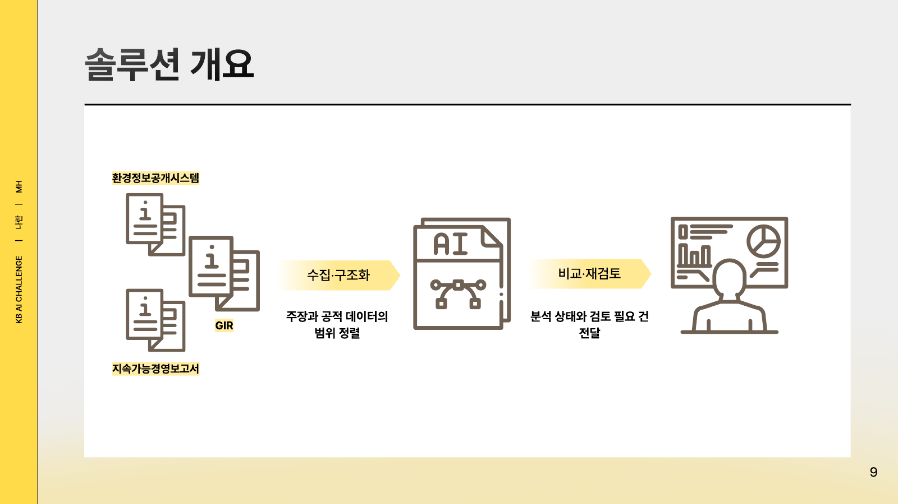
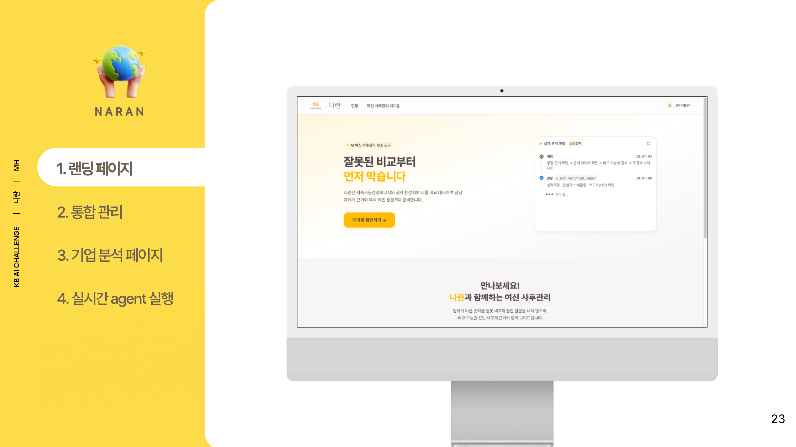
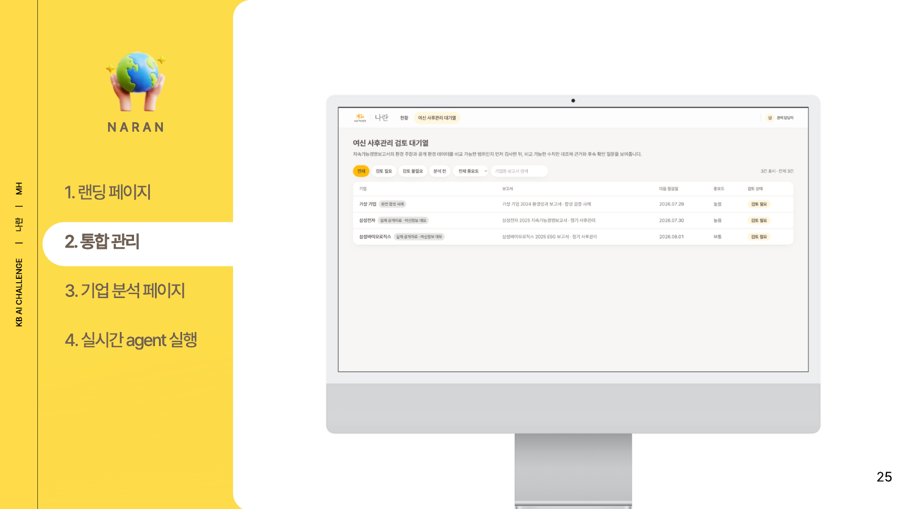
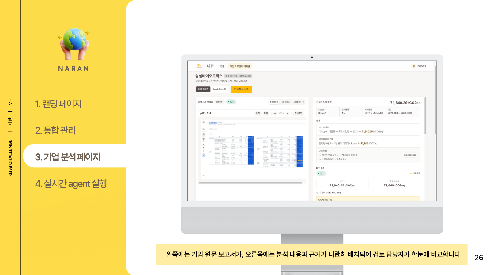
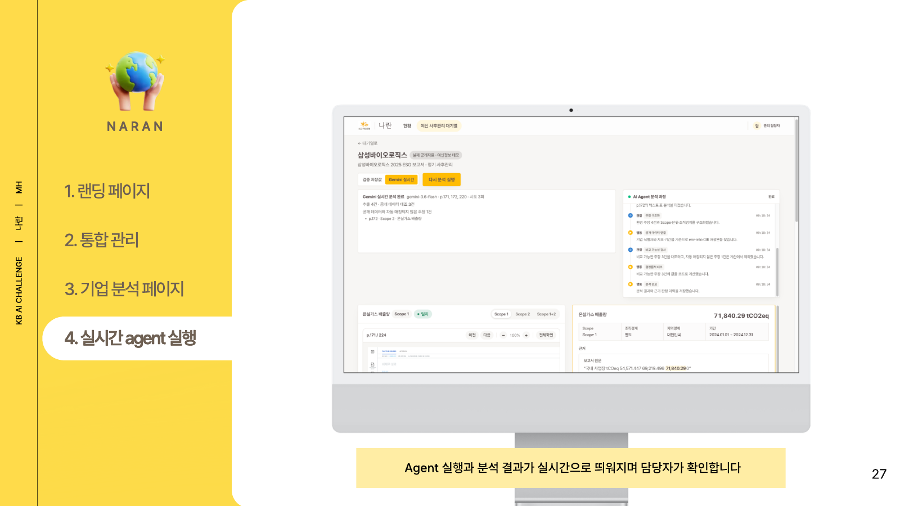
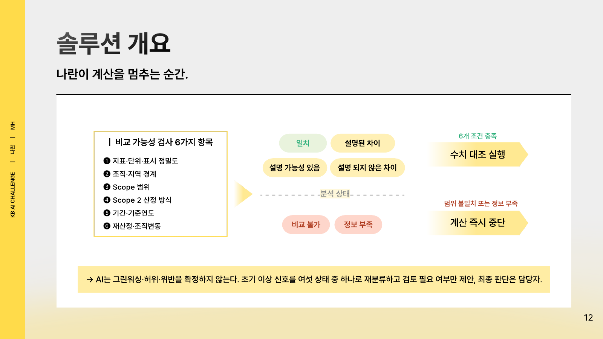
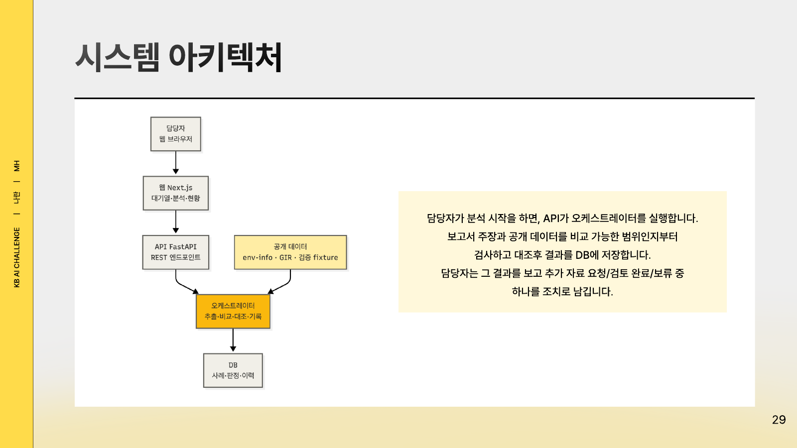
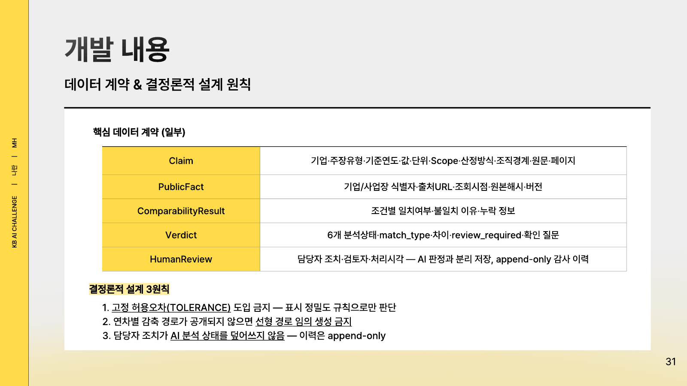

# 나란 (NaRan)


> **KB국민은행 제8회 Future Finance AI Challenge 출품작** · 팀 MH (김민지, 심하연)
>
> 사례 속 여신 정보는 모두 공모전 시연을 위한 합성 데이터이며, 실제 KB국민은행의 고객·여신 데이터가 아닙니다.

지속가능경영보고서의 환경 주장과 공개 환경 데이터를 같은 범위로 정렬한 뒤,
**비교 가능한 수치만 대조**하는 녹색여신 사후관리 보조 도구입니다.

조직경계·지역경계·Scope·산정 방식·단위·기간이 다르면 숫자를 억지로 계산하지 않고,
계산을 중단한 이유와 담당자가 확인할 사항을 제시합니다. 최종 업무 판단은 담당자가 하며,
담당자 조치는 AI 분석 결과와 분리해 append-only 감사 이력으로 남깁니다.



## 빠른 실행

Gemini API 키와 외부 네트워크 없이 핵심 기능 전체를 실행할 수 있습니다.
필요한 것은 Docker Desktop과 Git입니다.

```bash
git clone <제출한 GitHub 저장소 URL>
cd NaRan
cp .env.example .env
docker compose up --build
```

첫 실행은 이미지 빌드 때문에 시간이 걸립니다. 컨테이너가 모두 뜨면 아래 주소로 접속합니다.

| 용도 | 주소 |
| --- | --- |
| 웹 화면 | http://localhost:3000 |
| API 문서 | http://localhost:8000/docs |
| 상태 확인 | http://localhost:8000/health |

사후관리 대기열에서 사례를 열고 **검증 저장값**을 선택한 뒤 **분석 시작**을 누릅니다.

## 데모 사례

| 사례 | 데이터 | 기대 상태 | 확인할 장면 |
| --- | --- | --- | --- |
| 삼성전자 | 공식 2025 지속가능경영보고서 + env-info 검증 저장본 | `비교 불가` | 글로벌 전사 수치와 국내 개별 사업장 수치의 조직·지역 범위가 달라 **계산을 중단**하고 동일 범위 자료를 요청 |
| 삼성바이오로직스 | 공식 2025 ESG 보고서 + env-info·GIR 검증 저장본 | `일치` | 71,840.290 vs 71,840처럼 표시 자릿수가 다른 값을 범위 정렬 후 **표시 정밀도 범위 내 정합**으로 판정 |
| 가상 기업 | 재현 가능한 합성 fixture | `설명되지 않은 차이` | 모든 조건이 같은 Scope 1+2에서 100,000 vs 125,000tCO₂eq, 차이 25,000tCO₂eq(25%)를 계산하고 담당자 검토와 추가 자료 요청으로 연결 |

- 강한 불일치는 실제 기업이 아닌 합성 사례로만 시연합니다.
- 가상 기업의 25%는 두 합성 수치의 결정론적 차이율이며, 위험점수나 위법 가능성을 뜻하지 않습니다.
- 사례별 근거 페이지와 정답은 [fixtures/ground_truth.md](fixtures/ground_truth.md)에 있습니다.

### 화면

| 랜딩 페이지 | 사후관리 대기열 |
| --- | --- |
|  |  |
| **기업 분석 페이지** — 왼쪽에 보고서 원문, 오른쪽에 분석 근거 | **실시간 Agent 실행** — 분석 단계와 결과가 실시간으로 표시 |
|  |  |

## 분석 흐름

```text
보고서 주장 추출 → 공개 데이터 연결 → 비교 가능성 검사 ─┬─ 정보 부족 / 비교 불가 → 계산하지 않고 확인 사항 제시
                                                        └─ 비교 가능 → 결정론적 대조 → 분석 상태·검토 라우팅 → 담당자 조치
```

1. 보고서 주장과 공개 데이터를 기업·사업장 단위로 연결합니다.
2. 지표·단위·절대량/원단위·조직경계·지역경계·Scope·Scope 2 산정 방식·기간을 조건별로 검사합니다.
3. 필수 정보가 없으면 `정보 부족`, 범위가 다르면 `비교 불가`로 분류하고 차이를 계산하지 않습니다.
4. 비교 가능한 수치만 표시 정밀도를 고려해 절대 차이와 차이율을 계산합니다. 고정 허용오차는 쓰지 않습니다.
5. 여섯 분석 상태(`일치`, `설명된 차이`, `설명 가능성 있음`, `설명되지 않은 차이`, `비교 불가`, `정보 부족`)와 `review_required`를 결정합니다.
6. 담당자는 `추가 자료 요청`·`검토 완료`·`보류` 중 하나를 선택하며, 모든 변경이 감사 이력으로 남습니다.
7. 각 단계의 계획·행동·관찰과 근거를 AI Agent 실행 과정으로 표시합니다.



## 두 가지 분석 모드

분석 모드는 사례 화면에서 실행할 때마다 선택합니다.

| 구분 | 검증 저장값 (기본·심사용) | Gemini 실시간 (선택) |
| --- | --- | --- |
| 주장 추출 | 실제 보고서에서 미리 추출·검수한 주장 사용 | 보고서 PDF의 지정 페이지를 Gemini structured output으로 추출 |
| 필요 조건 | 없음 | `GEMINI_API_KEY`, 외부 네트워크 |
| 대상 사례 | 세 사례 모두 | 삼성바이오로직스(p.171·172·220), 삼성전자(p.68) |
| 비교 가능성 검사·계산·상태 판정·HITL | 동일한 애플리케이션 코드 | 동일한 애플리케이션 코드 |

검증 저장값 모드는 최종 화면을 저장해 두고 보여주는 방식이 아닙니다. 대체되는 부분은
**Gemini의 비정형 PDF 주장 추출**뿐이며, 이후 단계는 실행할 때마다 코드가 수행합니다.

LLM은 주장 후보 추출, 유형 분류, 메타데이터 구조화, 원문 위치 연결까지만 맡습니다.
비교 가능성 판정, 차이 계산, 최종 분석 상태는 결정론적 코드가 결정합니다.

### Gemini 실시간 모드 켜기

프로젝트 루트 `.env`에 본인의 API 키를 넣습니다.

```dotenv
GEMINI_API_KEY=발급받은_API_키
GEMINI_MODEL=gemini-3.6-flash
GEMINI_TIMEOUT_SECONDS=60
```

`.env`를 바꾼 뒤에는 API 컨테이너를 **다시 생성**해야 값이 반영됩니다.
`docker compose restart`로는 반영되지 않습니다.

```bash
docker compose up -d api
```

화면에서 **Gemini 실시간**을 선택하고 분석을 실행합니다. 화면의 실행 요약에서
`Gemini 실시간 추출`과 `검증 저장값` 중 어느 경로를 사용했는지 확인할 수 있습니다.
API 사용량 제한이나 네트워크 오류가 생길 수 있으므로 심사 재현에는 검증 저장값 모드를
권장합니다. API 키는 저장소에 포함되지 않으며 `.env`는 Git에서 제외됩니다.

## 테스트

```bash
docker compose exec api pytest
```

테스트는 API 키와 네트워크 없이 실행됩니다. Docker 없이 실행하려면 아래
[Docker 없이 실행](#docker-없이-실행)의 가상환경을 준비한 뒤 `pytest`를 실행합니다.

## 시연 전 담당자 기록 초기화

사례·분석 결과는 두고 담당자 조치, 확인 사항 처리 기록, 감사 이력만 지웁니다.

```bash
docker compose exec api python -m db.reset_reviews
```

실행 후 브라우저를 새로고침합니다. `docker compose down -v`는 SQLite 볼륨 전체를 지워
분석 실행 기록까지 초기화하므로 주의해야 합니다. 사례 데이터는 다음 실행 때 fixture에서
다시 적재됩니다.

## Docker 없이 실행

Python 3.11 이상과 Node.js가 필요합니다.

```bash
python -m venv .venv
source .venv/bin/activate
pip install -r requirements-dev.txt
cp .env.example .env
python -m db.init_db
uvicorn api.main:app --reload
```

별도 터미널에서 웹을 실행합니다.

```bash
cd web
npm install
npm run dev
```

`DATABASE_URL`을 비워 두면 [db/session.py](db/session.py)가 프로젝트 루트의
`naran.db`(SQLite)를 사용합니다.

## 환경변수

| 변수 | 기본값 | 설명 |
| --- | --- | --- |
| `DATABASE_URL` | 비어 있음 → 로컬 SQLite | Docker 실행 시에는 compose가 볼륨 경로를 지정 |
| `ALLOWED_ORIGINS` | 비어 있음 | 추가 CORS 오리진(콤마 구분) |
| `GEMINI_API_KEY` | 비어 있음 | Gemini 실시간 모드에만 필요 |
| `GEMINI_MODEL` | `gemini-3.6-flash` | 실시간 추출 모델 |
| `GEMINI_TIMEOUT_SECONDS` | `60` | Gemini 호출 제한 시간(초) |

## 포함된 공식 보고서 원문

PDF 근거 화면과 Gemini 실시간 추출을 별도 다운로드 없이 재현할 수 있도록 분석 대상 보고서
2개를 [references/](references/)에 포함했습니다.

| 기업 | 저장 파일 | 공식 출처 | SHA-256 |
| --- | --- | --- | --- |
| 삼성바이오로직스 | [Samsung-Biologics-2025-ESG-Report_KR.pdf](references/Samsung-Biologics-2025-ESG-Report_KR.pdf) | [2025 ESG 보고서](https://samsungbiologics.com/common/fileDownload.do?_fdFileName_=d54f43d1d109443b9ce08c1edb021f2d.pdf&_fdFileOriName_=Samsung-Biologics-2025-ESG-Report_KR.pdf&_fdSubPath_=esg_tcfd) | `9efdc8847c7ebe843ffa468b637087ab5fb224972eecc74b5f696507195ff230` |
| 삼성전자 | [Samsung_Electronics_Sustainability_Report_2025_ENG.pdf](references/Samsung_Electronics_Sustainability_Report_2025_ENG.pdf) | [2025 지속가능경영보고서](https://www.samsung.com/global/sustainability/media/pdf/Samsung_Electronics_Sustainability_Report_2025_ENG.pdf) | `aee5b45480512c05b13b3bfceab1d170232aae847e6ba398b2ebdcab842f7155` |

두 문서는 각 기업이 공개한 공식 자료이며, 공모전 심사와 기능 재현을 위한 분석 원문으로
포함했습니다. 문서의 저작권과 상표권은 각 권리자에게 있습니다.

## 아키텍처와 설계 원칙





## 저장소 구조

```text
naran/       공통 Pydantic 데이터 계약
db/          DB 모델, 비교 가능성 검사, 대조 엔진, 목표 추적, PDF 파서, 공개 데이터 정규화
api/         FastAPI, 분석 오케스트레이터, Gemini 추출, HITL·감사 이력 API
web/         Next.js 사용자 화면
fixtures/    검증 사례, 추출 저장값, 공개 데이터 저장본, 정답지
references/  분석 대상 지속가능경영보고서 PDF
tests/       계약·비교 가능성·대조 엔진·API·통합 테스트
docker/      API·웹 Dockerfile
assets/      README 이미지
note/        구현 메모
```

설계 원칙과 도메인 규칙은 [claude.md](claude.md)를 참고해 주세요.
